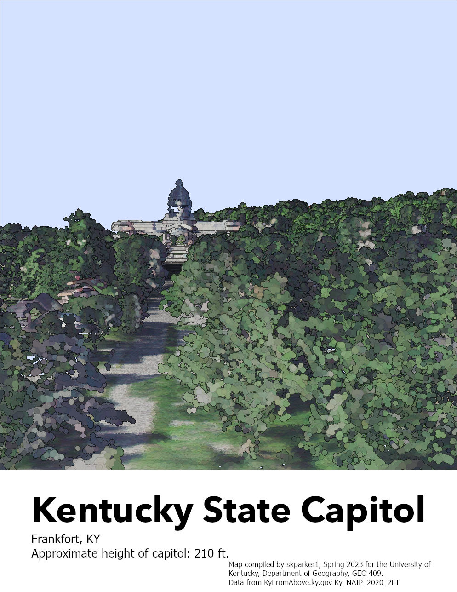

# geo-409-Kentucky-State-Capitol
# Kentucky State Capitol
The Kentucky State Capitol is located in Frankfort, KY and was built in 1910.

     
*A view of the Kentucky State Capitol from Capitol Avenue in Frankfort, KY.*

     
*[Link to Animation Video](https://youtu.be/XMRbbbjYewQ)*